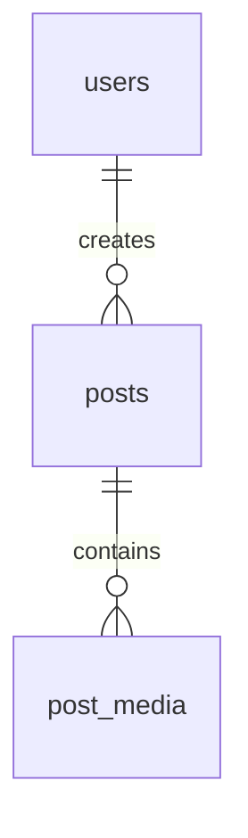

# DATABASE_SCHEMA.md - Thiết Kế Cơ Sở Dữ Liệu Connexa (Giai Đoạn 1: CRUD Bài Viết)

Tài liệu từ điển dữ liệu (Data Dictionary), quy ước đặt tên và cấu trúc bảng cho cơ sở dữ liệu PostgreSQL của hệ thống Connexa.

---

## 1. Quy ước đặt tên & Chuẩn dữ liệu (Conventions)

- **Tên bảng**: Danh từ số nhiều, chữ thường, dạng `snake_case` (ví dụ: `users`, `posts`, `post_media`).
- **Khóa chính (PK)**: Luôn là `id UUID PRIMARY KEY DEFAULT gen_random_uuid()`.
- **Khóa ngoại (FK)**: Dạng `<tên_thực_thể_số_ít>_id` kiểu `UUID`. Bắt buộc cấu hình `ON DELETE CASCADE`.
- **Thời gian (Timestamp)**: Sử dụng kiểu `TIMESTAMP` (Without Time Zone), mặc định `DEFAULT CURRENT_TIMESTAMP`.
- **Cờ logic (Booleans)**: Bắt đầu bằng tiền tố `is_` (ví dụ: `is_deleted`, `is_edited`), kiểu `BOOLEAN DEFAULT FALSE`.
- **Chuỗi văn bản ngắn**: Dùng `VARCHAR(length)` có giới hạn.
- **Văn bản dài**: Dùng `TEXT`.

---

## 2. Sơ đồ ERD Giai đoạn 1 (Core Post Scope)

---

## 3. Cấu trúc Bảng Giai đoạn 1 (Active Schema)

### 3.1. Bảng `users` (Bảng phụ trợ cho Auth & Tác giả)
> **Lưu ý**: Khớp 100% với Entity `User.java` hiện có để đảm bảo hệ thống Auth & Chat không bị ảnh hưởng.

| Tên cột | Kiểu dữ liệu | Ràng buộc | Mô tả |
| :--- | :--- | :--- | :--- |
| `id` | `UUID` | `PRIMARY KEY, DEFAULT gen_random_uuid()` | Khóa chính |
| `username` | `VARCHAR(255)` | `NOT NULL, UNIQUE` | Tên tài khoản |
| `email` | `VARCHAR(255)` | `NOT NULL, UNIQUE` | Email đăng nhập |
| `password` | `VARCHAR(255)` | `NOT NULL` | Mật khẩu (đã mã hóa) |
| `role` | `VARCHAR(50)` | `NOT NULL, DEFAULT 'USER'` | Phân quyền: `USER`, `ADMIN` |
| `avatar_url` | `TEXT` | `NULL` | Ảnh đại diện tác giả |
| `is_online` | `BOOLEAN` | `NOT NULL, DEFAULT FALSE` | Trạng thái online |
| `last_seen` | `TIMESTAMP` | `NULL` | Thời điểm online gần nhất |
| `created_at` | `TIMESTAMP` | `NOT NULL, DEFAULT CURRENT_TIMESTAMP` | Thời điểm tạo tài khoản |

---

### 3.2. Bảng `posts` (Trọng tâm Giai đoạn 1)
Lưu trữ thông tin cốt lõi của bài viết do người dùng đăng tải.

| Tên cột | Kiểu dữ liệu | Ràng buộc | Mô tả |
| :--- | :--- | :--- | :--- |
| `id` | `UUID` | `PRIMARY KEY, DEFAULT gen_random_uuid()` | Khóa chính duy nhất |
| `user_id` | `UUID` | `NOT NULL, REFERENCES users(id) ON DELETE CASCADE` | ID tác giả bài viết |
| `content` | `TEXT` | `NOT NULL` | Nội dung văn bản bài viết |
| `privacy` | `VARCHAR(20)` | `NOT NULL, DEFAULT 'PUBLIC'` | Mức quyền: `PUBLIC`, `FRIENDS_ONLY`, `PRIVATE` |
| `like_count` | `INTEGER` | `NOT NULL, DEFAULT 0` | Số lượt like (Bộ đếm tối ưu cho Phase 2) |
| `comment_count`| `INTEGER` | `NOT NULL, DEFAULT 0` | Số bình luận (Bộ đếm tối ưu cho Phase 2) |
| `is_edited` | `BOOLEAN` | `NOT NULL, DEFAULT FALSE` | Đánh dấu bài viết đã chỉnh sửa |
| `is_deleted` | `BOOLEAN` | `NOT NULL, DEFAULT FALSE` | Cờ xóa mềm (Soft Delete) |
| `created_at` | `TIMESTAMP` | `NOT NULL, DEFAULT CURRENT_TIMESTAMP` | Thời điểm đăng bài |
| `updated_at` | `TIMESTAMP` | `NOT NULL, DEFAULT CURRENT_TIMESTAMP` | Thời điểm cập nhật gần nhất |

**Chỉ mục (Indexes):**
- `idx_posts_user_id`: Tăng tốc truy vấn trang cá nhân (Profile timeline).
- `idx_posts_feed`: Composite Index trên `(is_deleted, privacy, created_at DESC)` để tối ưu câu truy vấn danh sách bài viết.

---

### 3.3. Bảng `post_media` (Tệp đính kèm bài viết)
Lưu trữ danh sách hình ảnh/video đính kèm (URL lưu trên Cloudinary).

| Tên cột | Kiểu dữ liệu | Ràng buộc | Mô tả |
| :--- | :--- | :--- | :--- |
| `id` | `UUID` | `PRIMARY KEY, DEFAULT gen_random_uuid()` | Khóa chính media |
| `post_id` | `UUID` | `NOT NULL, REFERENCES posts(id) ON DELETE CASCADE` | Thuộc bài viết nào |
| `media_url` | `TEXT` | `NOT NULL` | URL ảnh/video từ Cloudinary |
| `media_type` | `VARCHAR(20)` | `NOT NULL, DEFAULT 'IMAGE'` | Phân loại: `'IMAGE'`, `'VIDEO'` |
| `display_order` | `INTEGER` | `NOT NULL, DEFAULT 0` | Thứ tự hiển thị ảnh |
| `created_at` | `TIMESTAMP` | `NOT NULL, DEFAULT CURRENT_TIMESTAMP` | Thời điểm tải lên |

**Chỉ mục (Indexes):**
- `idx_post_media_post_id`: Tối ưu việc tải danh sách media theo `post_id`.

---

## 4. Lộ trình Mở rộng (Phase 2 Roadmap - Tạm thời DISABLE)
Các bảng dưới đây đã được thiết kế sẵn khung cấu trúc và sẽ kích hoạt migration khi nhóm bước sang Giai đoạn 2:
- **`comments`**: Quản lý bình luận đa cấp (Parent-Child).
- **`post_reactions`**: Quản lý cảm xúc bài viết (`LIKE`, `LOVE`, `HAHA`,...).
- **`friendships`**: Quản lý quan hệ bạn bè (`PENDING`, `ACCEPTED`).
- **`conversations`, `participants`, `messages`**: Hệ thống Chatify Realtime.
